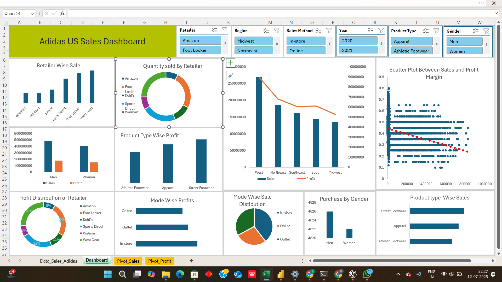
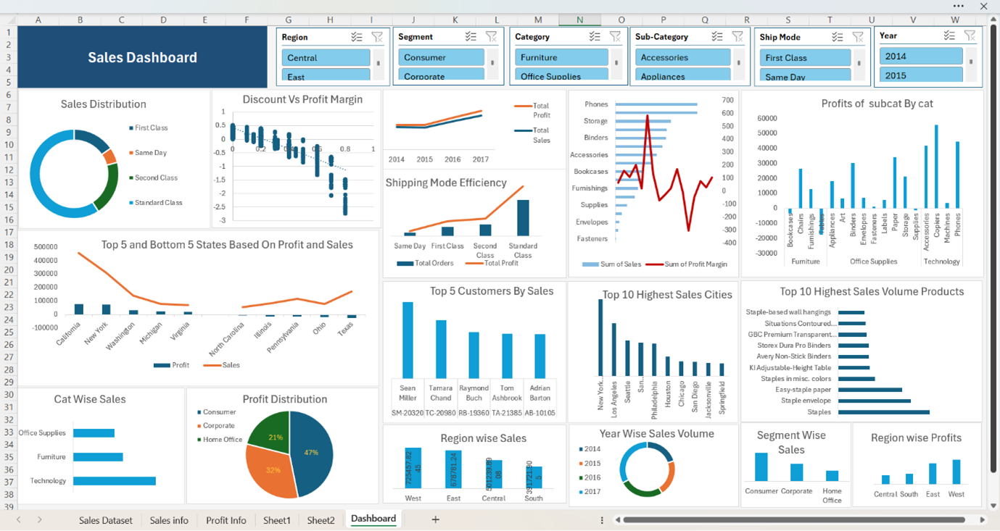

# 📊 Excel Projects Portfolio

Welcome to my **Excel Projects Portfolio**, a curated collection of **Excel functions, pivot tables, and dashboards** — all showcased through screenshots. This repository highlights my hands-on skills in **data analysis, reporting, and visualization**. It serves as a portfolio for potential employers and as a visual reference for Excel techniques applied in real-world scenarios.  

This portfolio demonstrates:  
- **Excel Functions** – Logical, lookup, text, statistical, and advanced formulas.  
- **Pivot Tables & Analysis** – Summarized datasets to extract actionable insights.  
- **Dashboards** – Interactive visuals with charts, KPIs, and business insights.  
- **Advanced Excel Techniques** – Conditional formatting, What-If analysis, array formulas, and more.

> ⚠️ **Note:** Only screenshots are provided. Actual Excel files and datasets are not included.

---

## 📷 Preview of Examples

### Dashboards
  


---

## 📂 Folder Structure

```plaintext
excel-projects-portfolio/
│
├── Functions/                        # Contains all Excel function and pivot table screenshots
│    ├── Function_Examples.png        # Demonstrates formulas and functions
│    └── Pivot_Tables_Examples.png    # Shows pivot table summaries
│
├── Dashboards/                        # Contains all Excel dashboard screenshots
│    ├── Adidas.png                    # Visual dashboard for Adidas dataset
│    └── globalstore.png               # Visual dashboard for Global Store dataset
│
├── README.md                         # Project overview and instructions
└── LICENSE                           # License information for the repository

```
---


## 🎯 Purpose

This portfolio is designed to:

- Showcase hands-on Excel skills including **formulas, pivot tables, and dashboards**.  
- Provide a **visual reference** for Excel techniques applied in real-world scenarios.  
- Serve as a **professional portfolio** for recruiters, hiring managers, or anyone learning Excel analytics.  
- Highlight my ability to create **interactive dashboards**, apply **advanced functions**, and summarize data effectively for business insights.

---

## 🛠️ How to Explore

1. Open the **Functions folder** to view formulas and pivot table examples.  
2. Open the **Dashboards folder** to see interactive and visual dashboards.  
3. Each screenshot demonstrates **key Excel skills**, suitable for portfolio presentation or learning inspiration.

---

## 🛡️ License

This project is licensed under the **MIT License**. You are free to use, modify, and share this portfolio with proper attribution.

---

## 🌟 About Me


Hi there! I'm **RAVI SANKAR REDDY BOVILLA **. I’m  passionate about data analyst and data engineering
